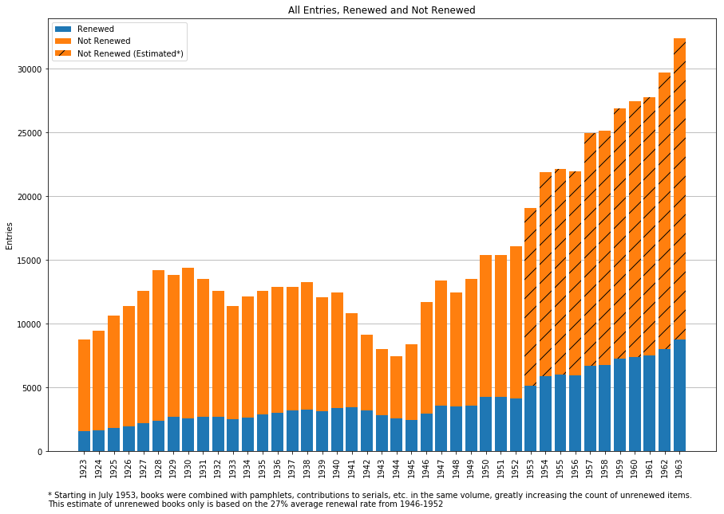

# Catalog of Copyright Entries Project
NYPL Project to transcribe and parse pages from the US Catalog of Copyright Entries

The New York Public Library (NYPL) is embarking on a pilot project to extract the data from a publication known as the Catalog of Copyright Entries, published annually by the United States Copyright Office. The volumes have already been digitized and are [freely available through the Internet Archive](https://archive.org/details/copyrightrecords); our project aims to extract and parse the data contained in the records in order to create a searchable database that will aid copyright research.

For more on the project, see ["Unlocking the Record of American Creativity—with Your Help"](https://www.nypl.org/blog/2018/03/30/unlocking-record-american-creativity)

For more on the catalog, see the following: 

- [UPenn Online Books Page for Copyright Catalog](http://onlinebooks.library.upenn.edu/cce/)
- [Wikipedia article](https://en.wikipedia.org/wiki/Copyright_Catalog)
- [Catalog Volumes on Internet Archive](http://archive.org/details/copyrightrecords/)

## Data Structure and Contents

All data files are in the [./xml](./xml/) directory, organized by year. The XML files conform to the [project DTD](CopyrightEntries.dtd), and each directory has an `alto` subdirectory with [ALTO](https://altoxml.github.io/) format files for the original OCR.

See [TOC.md](xml/TOC.md) for details on the volumes transcribed so far.

### CopyrightEntries.dtd

The main components of an XML files, within the root `<copyrightEntries>` element are a mandatory `<header>` followed by any order of `<copyrightEntry>`, `<entryGroup>`, `<crossRef>` and `<pgNum>` elements.

There are tags for identifyings authors, titles, publishers, and claimants, as well as the various dates and id numbers that an entry can contain. Many entries have attributes for recording normalized versions of dates and numbers or for identifying where corrections have been made.

 See the [Guide](./guide.md) for specifics of formatting entries.

### Anatomy of a Registration

The format of entries in the _Catalog_ varies widely over time but they essentialy contain simple bibliographic information and a registration date and id number.

    ADAMS, JAMES DONALD.

      Literary frontiers.  New
        York, Duell, Slone and
        Pearce.  175 p. © J. Donald 
		Adams; 6Jun51; A56505.

This is converted to XML:

    <copyrightEntry 
         id="1D4D33CD-6E97-1014-8315-97D5E63C7536"
         regnum="A56505">
      <author>
        <authorName>ADAMS, JAMES DONALD</authorName>.
      </author> 
      <title>Literary frontiers.</title>
      <publisher>
        <pubPlace>New York</pubPlace>, 
        <pubName>Duell, Sloan and Pearce.</pubName> 
      </publisher>
      <desc>175 p.</desc> 
      &#xA9; <claimant>J. Donald Adams</claimant>;
      <regDate date="1951-06-06">6Jun51</regDate>; 
      <regNum>A56505</regNum>.
    </copyrightEntry>
    
Our top priority is to correctly tag the registration numbers and dates since these are required to match registrations to renewals. Next in priority are the authors and titles although for practical purposes a full-text search is probably adequate to find an entry.

### Identifiers

Every registration should have a registration number, such as `A56505`, but these are not unique. Numbering was restarted in "Third Series" (1947–) so there is quite a bit of overlap between this and the "New Series." For example, the example entry above shares a registration number with another book _Barton Warren Stone, pathfinder of Christian union; a story of his life and times_ registered in 1932. Because of this a registration number _and_ date is always required to distinguish `A56505/1951-06-06` from `A56505/1932-10-12`

In addition every `<copyrightEntry`> and `<crossRef>` is assigned a UUID so that it can be uniquely identified, even if the registration number or date is changed (for instance, to correct a typo).

### Renewals

These volumes were chosen to transcribe first because they come from the period when a book may in copyright if its first 28-year copyright term was renewed, while it is otherwise public domain. Renewal data is available from the Stanford [Copyright Renewals Database](https://exhibits.stanford.edu/copyrightrenewals) and from an [NYPL version](https://github.com/NYPL/cce-renewals/) of essentially the same sources. The NYPL version is better formatted for matching renewal entries with the registrations in these XML files.

By combining the two datasets we can determine how many books were registered for copyright in every year between 1923 and 1963, as well as how many were renewed:

For this period we have about 642,000 books registered for copyright. Of these about 162,000 or 25% had their copyrights renewed. So, the copyright has expired on 75% of the books published during these years, about 480,000, and they are now in the Public Domain.

## User Stories for Search Interface

Although we do not have an official search interface for this data yet, we gathered a group of experts in Copyright Office records to discuss user needs and requirements for a search interface system. That group prioritized a list of [user stories](https://github.com/NYPL/catalog_of_copyright_entries_project/wiki/User-Stories) that could be used to start to develop such a search interface system.

**Press Inquiries**: Please contact [Greg Cram](mailto:gregcram@nypl.org) or [Sean Redmond](mailto:seanredmond@nypl.org)
