# Markup Guide for Catalog of Copyright Entries XML

The aim of this XML format is to be descriptive, not to specify the "perfect" catalog of copyright entry. We want to follow two simple principles:

1. Capture everything. Assume that every detail might be interesting
   to someone.
2. Don't add anything. We want to be make inferences _from_ the XML,
   not add inferences _into_ the XML.
   
Because there is such a wide variation in the formats of the entries,
some of the definition has to be very generous. Anything added will be
added as attributes of the various elements, so that if the XML is
stripped out, the original text of the entry will remain. We are not
concerned with formatting such as line breaks and font changes.

## Top level elements

The root of each document is a `<copyrightEntries>` element. This
contains any number of `<copyrightEntry>`, `<entryGroup>` and
`<crossRef>` elements.

### `copyrightEntry`

`copyrightEntry` is the container the main kind of entry

    ADAMS, JAMES DONALD.

      Literary frontiers.  New
        York, Duell, Slone and
        Pearce.  175 p. © J. Donald 
		Adams; 6Jun51; A56505.

[This entry from 1951](https://archive.org/stream/catalogofcopyri351libr#page/402/mode/1up) contains the usual bibliographical elements such as author,
title, and publisher, along with the date (`6Jun51`) and the number
(`A56505`) of the copyright registration. Other volumes have different formats, (and some entries have more and less information), but the data contained is essentially the same, as in [this entry from 1927](https://archive.org/stream/catalogofcopyrig241libr#page/3/mode/1up)

    Bunt, James
      Rabbit diseases; cause, prevention, treatment and cure, by 
	James Bunt ... Kansas City, Mo., The Outdoor enterprise 
	publishing company, 1926.

      22 p. illus. 19cm.

    © Dec. 23, 1926; 2c and aff. Dec. 31; A 957926; Outdoor enterprise
      pub. co. (27-1104) 17
	  
Each of these examples would be contained in a `catalogEntry` element. Each entry will have unique ID for reference, and the registration number will be repeated as a `regnum` attribute:

      <copyrightEntry id="[GUID]" regnum="A56505">
          ...
      </copyrightEntry>

      <copyrightEntry id="[GUID]" regnum="A957926">
          ...
      </copyrightEntry>
	  
Note the spaces removed from the registration number in the second entry.

### `entryGroup`

When multiple entries are listed under a single author, the are an
`entryGroup` ([example from
1962](https://archive.org/stream/catalogofcopyrig3161lib#page/1142/mode/1up)):

    ADLER, MORTIMER J.
      Ethics; the study of moral values,
        by Mortimer J. Adler & Seymour
        Cain. Pref. by William Ernest
        Hocking. (The Great ideas program,
        8) © Encyclopaedia Brittanica,
        Inc.; 2Jul62; A574004.

      Imaginative literatur I; from Homer 
	    to Shakespeare, by Mortimer J.
	    Adler & Seymour Cain. Pref. by
        Saul Bellow. (The Great ideas 
		program, 6) © Encyclopaedia
        Brittanica, Inc.; 1Dec61; A574002.

These two entries would be marked up as an `entryGroup` with an `author` and two `catalogEntry` elements:

    <entryGroup>
      <author><authorName>ADLER, MORTIMER J.</authorName><author>
	  <copyrightEntry id="[GUID] regnum="A574004">
          ...
      </copyrightEntry>
      <copyrightEntry id="[GUID] regnum="A574002">
          ...
      </copyrightEntry>
    </entryGroup>

### `crossRef`

Some entries are simply cross-references: 

    BELL, ELEXIOUS THOMPSON, ed.
      Hypertension. SEE Symposium on
	  Hypertension, University of Minnesota,
	  1950.
	  
These are contained in a `crossRef` element, which is mostly like a `copyrightEntry` except that it doesn't have a registration number, but does have a `see` element:

    <crossRef id="[GUID]">
      <author><authorName>BELL, ELEXIOUS THOMPSON</authorName>, 
	  <role>ed.</role></author>
      <title>Hypertension</title> SEE <see rid="[GUID]">
	  <title>Symposium on Hypertension, University of Minnesota</title>, 
	  <pubDate>1950</pubDate></see>
    </crossRef>
	
The `rid` attribrute of the `see` element should point to the `id` of the
corresponding `copyrightEntry`.

## Contents of a `copyrightEntry`

A `copyrightEntry` is has no required or forbidden children, so it is very flexible. 

1. Every identifiable piece of information should be marked up with a
   proper element.
2. But don't be overly specific about things that can be inferred from
   context or determined in post-processing. For instance, names are
   hard and appear sometimes as "firstname lastname", sometimes as
   "lastname, firstname". Sometimes in all caps and sometimes not. It
   will suffice for all these variations to be contained in an
   `authorName` as a lot of indexing and massaging will probably
   required later to make them useful, anyway.
3. Punctuation and symbols do not need to be marked up. Exclude as
   much punctuation as possible from the contents of elements.

There are some general rules and expectations.

1. Every entry _must_ have a title.
2. Every entry _should_ have a registration date. We have found
   examples without but they are aberrant.
3. Every entry _should_ have a registration number. Again, there are
   aberrant examples.
4. Every entry _should_ have a claimant. If there is a publisher
   listed, and no other indication of the claimant, the publisher is
   the claimant. Some volumes use an asterisk to mark the author when
   the author is a claimant. If there is no publisher listed, the
   author is probably the claimant whether or not marked with an
   asterisk.

### `author`

An author can contain `authorName`, `authorBirth`, `authorDeath`, ` authorPlace` and `role` in any combination. `author` is used both when the author's name is an implicit or explicit heading, and when it is in the body of an entry

    <copyrightEntry id="[GUID]" regnum="A56505">
      <author><authorName>ADAMS, JAMES DONALD</authorName></author>.

        Literary frontiers.  New
          York, Duell, Slone and
          Pearce.  175 p. © J. Donald 
		  Adams; 6Jun51; A56505.
    </copyrightEntry>

    <copyrightEntry id="[GUID]" regnum="A957926">
      <author><authorName>Bunt, James</authorName></author>
        Rabbit diseases; cause, prevention, treatment and cure, 
		<author><role>by</role> <authorName>James Bunt</authorName></author>
		... Kansas City, Mo., The Outdoor enterprise 
	    publishing company, 1926.

      22 p. illus. 19cm.

      © Dec. 23, 1926; 2c and aff. Dec. 31; A 957926; Outdoor enterprise
        pub. co. (27-1104) 17
    </copyrightEntry>
	
    <copyrightEntry id="[GUID]" regnum="A17700">
      <author><authorName>Burnett, William Riley</authorName>,
      <authorBirth>1899</authorBirth>-</author>

        Iron Man, <author><role>by</role>
      <authorName>W. R. Burnett</authorName></author>... 
	  New York, L. MacVeagh,
	  The Dial Press; Toronto, Longmans, Green and co. [ᶜ1930]

        5 p. l., 3-312 p. 19 ½ cm. 
	  © Jan. 2, 1930; 2c and aff. Jan. 6; A 17700; Dial Press, inc.
        (30-842) 11
    </copyrightEntry>

    <copyrightEntry id="[GUID]" regnum="A190420">
      <author claimant="yes"><authorName>Curtis, Charles P.,
      jr.</authorName>,* <authorPlace>Ipswich,
      Mass.</authorPlace></author> &amp; <author
      claimant="yes"><authorName>Greenslet, Ferris</authorName>,*
      <authorPlace>Boston</authorPlace></author>. 
	  The practical cogitator. <author><role>selected and edited by</role>
      <authorName>C. P. Curtis, jr.</authorName></author> and
      <author><authorName>Ferris Greenslet</authorName></author>. 
	  © Oct. 9, 1945; A 190420.
    </copyrightEntry>

	
Note that, in the first example, the name in `© J. Donald Adams` is
not an `author` (see `claimant` below). 

In the second example, the asterisk after each of the authors' names
indicates that they are the copyright claimants. We record this by
adding the attribute,`claimant="yes"`. The asterix does not need to be
included in any element.

The last example show a common case of new matter claimed, with a `regDate` for the new matter and a claimant (often just indicated as "publisher" or "author").

### `title`

Simple, the title of the work.

    <copyrightEntry id="[GUID]" regnum="A56505">
      <author><authorName>ADAMS, JAMES DONALD</authorName></author>.

        <title>Literary frontiers</title>.  New
          York, Duell, Slone and
          Pearce.  175 p. © J. Donald 
		  Adams; 6Jun51; A56505.
    </copyrightEntry>
	
### `publisher`

A `publisher` can contain `pubName`, `pubPlace`, and `pubDate`:

    <copyrightEntry id="[GUID]" regnum="A56505">
      <author><authorName>ADAMS, JAMES DONALD</authorName></author>.

        <title>Literary frontiers</title>.
		<publisher><pubPlace>New York</pubPlace>, <pubName>Duell, Slone and
        Pearce</pubName></publisher>. 175 p. © J. Donald 
		  Adams; 6Jun51; A56505.
    </copyrightEntry>

    <copyrightEntry id="GUID1" regnum="A957926">
      <author><authorName>Bunt, James</authorName></author>

    <copyrightEntry id="[GUID]" regnum="A957926">
      <author><authorName>Bunt, James</authorName></author>
        Rabbit diseases; cause, prevention, treatment and cure, 
		<author><role>by</role> <authorName>James Bunt</authorName></author>
		... <publisher><pubPlace>Kansas City,
        Mo.</pubPlace>, <pubName>The Outdoor enterprise publishing
        company</pubName>, <pubDate>1926</pubDate></publisher>.

      22 p. illus. 19cm.

      © Dec. 23, 1926; 2c and aff. Dec. 31; A 957926; Outdoor enterprise
        pub. co. (27-1104) 17
    </copyrightEntry>

There can be more than one:

    <copyrightEntry id="[GUID]" regnum="A17700">
      <author><authorName>Burnett, William Riley</authorName>,
      <authorBirth>1899</authorBirth>-</author>

        Iron Man, <author><role>by</role>
      <authorName>W. R. Burnett</authorName></author>... 
      <publisher><pubPlace>New
      York</pubPlace>, <pubName>L. MacVeagh, The Dial
      Press</pubName></publisher>; <pubName>Longmans, Green
      and co.</pubName> [ᶜ<pubDate>1930</pubDate></publisher>

        5 p. l., 3-312 p. 19 ½ cm. 
	  © Jan. 2, 1930; 2c and aff. Jan. 6; A 17700; Dial Press, inc.
        (30-842) 11
    </copyrightEntry>

### `desc`

Pagination, book dimensions, etc. are contained in a `desc` element

    <copyrightEntry id="[GUID]" regnum="A56505">
      <author><authorName>ADAMS, JAMES DONALD</authorName></author>.

        <title>Literary frontiers</title>.
		<publisher><pubPlace>New York</pubPlace>, <pubName>Duell, Slone and
        Pearce</pubName></publisher>. <desc>175 p.</desc> © J. Donald 
		  Adams; 6Jun51; A56505.
    </copyrightEntry>

### Copyright claim details

The most important items in these entries are the details of the copyright claim. Each entry should have a claimant (explicit or implied) a registration date (`regDate`) and a registration number (`regNum`). In addition there are elements to record the number of copies depositied (`copies`) and the other dates (`affDate`).

    <copyrightEntry id="[GUID]" regnum="A56505">
      <author><authorName>ADAMS, JAMES DONALD</authorName></author>.

        <title>Literary frontiers</title>.
		<publisher><pubPlace>New York</pubPlace>, <pubName>Duell, Slone and
        Pearce</pubName></publisher>. <desc>175 p.</desc> 
		© <claimant>J. Donald Adams</claimant>; 
		<regdate date="1951-06-06">6Jun51</regDate>; <regNum>A56505</regNum>.
    </copyrightEntry>

#### regNum

Every `<copyrightEntry>` should have a regnum. We _have_ found entries published without one, though. The registration number should both be marked up with a `regNum` element _and_ duplicated and regularized as the `regnum` attribute of the `copyrightEntry`. Most regNums follow the format

    [class][serial prefix][serial number]
	
Where class is one of `A`, `AF`, or `AI` (though there are more than a dozen other class codes, so far only `AA`, `B`, `DF`, `DP`, `JP`, and `K`). Serial numbers consist only of the digits 0-9. The only serial prefix is `0-`. Examples of canonical registration numbers:

    A12345
    AF12345
    AF0-12345
    AI12345
    AI0-12345

Earlier volumes use fewer prefixes, but different class formats, usually with spaces between the class code and serial number. These registration numbers should be transcribed _verbatim_ in `<regNum>` entities, but regularized in the `regnum` attributes of `<copyrightEntry>` elements according to these examples:

| `<regNum>`| regularized (for `regnum` attribute)|
|-------------|-------------------------------------|
| A 963122| A963122 |
| A—Foreign 32851 | AF32851 |
| A for. 48359 | AF48359 |
| A ad int. 8956 | AI8956 |
| A int. 241 | AI241 |

#### regDate

`regDate` (and other date elements) must have a `date` attribute with a normalized form (`YYYY-MM-DD` or `YYYY`). Registration dates should not be more than one year later than the date of the volume, or more than 28 years earlier. For instance, the 1951 volume should not have any entries with a `regDate` earlier than 1923 or later than 1952,

#### claimant

The claimant may the same as the author, as above, or be the publisher. In neither case is the `claimant` further parsed as an `author` or a `publisher`

    <copyrightEntry id="[GUID]" regnum="A17700">
      <author><authorName>Burnett, William Riley</authorName>,
      <authorBirth>1899</authorBirth>-</author>

        <title>Iron Man<title>, <author><role>by</role>
      <authorName>W. R. Burnett</authorName></author>... 
      <publisher><pubPlace>New
      York</pubPlace>, <pubName>L. MacVeagh, The Dial
      Press</pubName></publisher>; <pubName>Longmans, Green
      and co.</pubName> [ᶜ<pubDate>1930</pubDate></publisher>

        <desc> 5 p. l., 3-312 p. 19 ½ cm.</desc> © <regDate
      date="1930-01-02">Jan. 2, 1930</regDate>; <copies
      num="2">2c</copies> and aff. <affDate
      date="1930-01-06">Jan. 6</affDate>; <regNum>A
      17700</regNum>; <claimant>Dial Press, inc.</claimant>
      (30-842) 11
    </copyrightEntry>
	
In this example, note the use of `affDate` with the normalized `date` attribute, and `copies` with the number explicitly given by the `num` attribute.

Sometimes an asterisk indicates that an author or publisher is also the claimant. In these cases, there is no `claimant` element, but the `author` or `publisher` has a `claimant="yes"` attribute (see example above).

# Notes

Sometimes there extra information is given in brackets or parentheses. These can be marked up as `note` elements. In this case, the brackets or parentheses should be part of the element:

    <copyrightEntry id="GUI8" regnum="A189950">
      <author claimant="yes"><authorName>Cuthbert,
      Margaret</authorName>,* <authorPlace>New
      York</authorPlace></author>. <title>Adventure in radio</title>,
      <author><role>edited by</role>
      <authorName>M. Cuthbert</authorName></author>, <author><role>with
      radio scripts by</role> <authorName>Edna St.  Vincent
      Millay</authorName></author>, <author><authorName>Arch
      Obeler</authorName></author>, <author><authorName>Archibald
      MacLeish</authorName></author> <note>[and others]</note> ©
      <regDate date="1945-09-17">Sept.  17, 1945</regDate>;
      <regNum>A 189950</regNum>. 5511
    </copyrightEntry>
	
## Multiple claims in a single entry

Multiple volumes or issues of a work may be joined in a single entry. For this there is `additionalEntry`. The entry should be marked up as it would be for a single registration through the first registration number, then as many `additionalEntry` elements as necessary are added. An `additionalEntry` can contain any of the elements that a `copyrightEntry` can, but each will be distinguished by it's own `regNum` and probably `regDate`:

    <copyrightEntry id="[GUID]" regnum="BB21264">
      <title>THE ADVENTURES OF HAP HAZARD</title> <note>(in The
      Co-operator)</note> <author><role>Appl. author</role>:
      <authorName>Jack Hamilton</authorName></author>. ©
      <publisher><pubName claimant="yes">Employers Casualty
      Co.</pubName> <pubDate date="1962-07">Jul62></pubDate></publisher>
      © <regDate date="1962-07-12">12Jul</regDate>;
      <regNum>BB21264</regNum>.
      <additionalEntry regnum="BB21524">
        <pubDate date="1962-08">Aug62</pubDate>
        © <regDate date="1962-08-15">15Aug</regDate>;
        <regNum>BB21524</regNum>
      </additionalEntry>.
      <additionalEntry regnum="BB21695">
        <pubDate date="1962-09">Sep62</pubDate>
        © <regDate date="1962-09-11">11Sep</regDate>;
        <regNum>BB21695</regNum>
      </additionalEntry>.
      <additionalEntry regnum="BB21839">
        <pubDate date="1962-10">Oct62</pubDate>
        © <regDate date="1962-10-05">5Oct</regDate>;
        <regNum>BB21839</regNum>
      </additionalEntry>.
      <additionalEntry regnum="BB22021">
        <pubDate date="1962-11">Oct62</pubDate>
        © <regDate date="1962-10-23">23Oct</regDate>;
        <regNum>BB22010</regNum>
      </additionalEntry>.
    </copyrightEntry>
	
Note that the `copyrightEntry` as a whole has the first `regNum` as its `regnum` attribute.

Sometimes the registrations are expressed as a range:

    Callaghan's Michigan digest, v.16-18 © Dec. 15,
    1941; A 160078-160080; Callaghan & co., Chicago.
	                                         103-105
											 
In this case wrap the registration numbers in a `regNum` element as
they are. The explicit range of registration numbers is expressed in
the `regnum` attribute of the `copyrightEntry`:

    <copyrightEntry id="[GUID]" regnum="A160078 A160079 A160080">
      <title>Callaghan's Michigan digest</title>, <desc>v.16-18</desc>
      © <regDate date="1941-12-15">Dec. 15, 1941</regDate>; 
      <regNum>A 160078-160080</regNum>; 
      <publisher><pubName claimant="yes">Callaghan &amp; co.</pubName>, 
      <pubPlace>Chicago</pubPlace></publisher>.
      103-105
    </copyrightEntry>

Occasionally, related entries are grouped together with dates and ids
only given in the last entry. In cases like this the `regnum` and
`regdate` attributes of the first `copyrightEntry` can be filled in
from the second, and the `ignore` attribute set to `yes` on the
`regnum` and `regdate` elements in the second. This will make it
easier for parsing programs to know which numbers and dates go with
which entries:

	<entryGroup>
	  <author>
		<authorName>MacFarland, George Arthur</authorName>,
		<authorBirth>1887</authorBirth>&#x2013;
	  </author>
	  <copyrightEntry id="DA3ED929-6D0A-1014-853A-B63123D40E62" 
	                  regnum="A10905" regdate="1947-02-27">
		<title>Accounting fundamentals</title>,
		<author>
		  <role>by</role>
		  <authorName>George A. MacFarland</authorName> and
		  <authorName>Robert D. Ayars</authorName>.
		</author>
		<edition>2d ed.</edition>
		<publisher>
		  <pubPlace>New York</pubPlace>,
		  <pubName>McGraw-Hill Book Co.</pubName>,
		  <pubDate date="1947">1947</pubDate>.
		</publisher>
		<desc>xv, 759 p. 24&#x368;&#x36B;.</desc>
		<series>(McGraw-Hill accounting series)</series>
	  </copyrightEntry>
	  <copyrightEntry regnum="A10905" id="DA3F145C-6D0A-1014-853A-B63123D40E62">
		<title>Key.</title>
		<edition>2d ed.</edition> <publisher><pubPlace>New York</pubPlace>,
		<pubName>McGraw-Hill Book Co.</pubName>,
		<pubDate date="1947">1947</pubDate>.</publisher>
		<desc>401 p. 28&#x368;&#x36B;.</desc>
		&#xA9; <regDate date="1947-02-27" ignore="yes">27Feb47</regDate>;
		<publisher>
		  <pubName claimant="yes">McGraw-Hill Book Co., inc.</pubName>
		</publisher>; on &#x201C;Accounting fundamentals&#x201D;; 
		<regNum ignore="yes">A10905</regNum>.
		&#xA9; <regDate date="1947-06-02">2Jun47</regDate>;
		<publisher>
		  <pubName claimant="yes">McGraw-Hill Book Co., inc.</pubName>
		</publisher>; on &#x201C;Key&#x201D;;
		<regNum>AA55695</regNum>.
	  </copyrightEntry>
	</entryGroup>

# Duplicate Registration Numbers

Registration numbers are not unique because numbering was started over in 1946 with the switch from the "new series" to the "3rd series." You would expect registration numbers to be unique within a series or for the combination ofregistration number and registration date to be unique but even this is not always true. There are a number of cases where multiple entries may have the same registration number.

## Duplicated Entries

Sometimes it seems that a registration is mistakenly (?) repeated in more than one volume. For instance these two entries from 1950

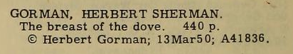

and 1951

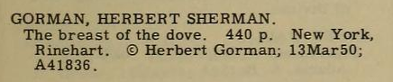

Both carry the number/date `A41836/1950-03-13`. The first entry is missing the publisher, so perhaps the second entry was printed to correct the first. In other cases, the entries are completely identical. Given a registration _A_, duplicate registration _B_, and renewal _C_, simply matching on registration number/date would link the renewal to both registrations:

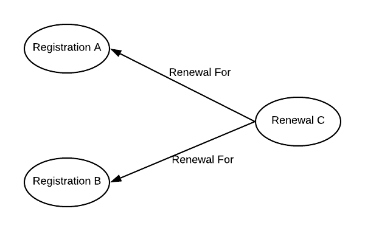

The `duplicateOf` attribute of the `copyrightEntry` element can be used in this case to indicate that one entry is the duplicate of another. Since there is really only _one_ copyright and _one_ renewal we want to be able to designate one of two duplicates as the "main" entry and link a renewal to that only:

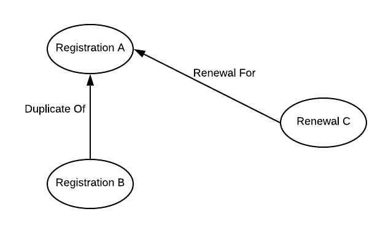

In the example above, since the 1951 entry has some more information than the 1950 entry, the attribute should be added to the earlier one with the UUID of the later one as the attribute value. 

    <copyrightEntry id="3F97A4D3-79DE-1014-B198-F9D02DA5A3BD" 
                    regnum="A41836"
                    duplicateOf="252D32E5-6D96-1014-9FA7-88F81FCFA0F7">
      <author><authorName>GORMAN, HERBERT SHERMAN.</authorName></author> 
      <title>The breast of the dove.</title> 
      <desc>440 p.</desc> &#x000A9; <claimant>Herbert Gorman</claimant>; 
      <regDate date="1950-03-13">13Mar50</regDate>; <regNum>A41836</regNum>.
    </copyrightEntry>

The `duplicateOf` attribute indicates that the entry _with_ the attribute contains the same information as the entry it points to and _adds nothing to it_. They _must_ both have identical registration numbers and dates. In the example above, the 1951 entry should not have the `duplicateOf` attribute pointing to the 1950 entry because the former has the publisher where the latter does not.

All other things being equal, later duplicates should refer to earlier entries. If there are multiple duplications all duplicates should point to the same "master" registration. That entry must _not_ have a `duplicateOf` attribute. 

When processing, any entries carrying a `duplicateOf` attribute can be skipped since, if an entry is truly a duplicate, it adds nothing the copyright history of the wrok. When importing into a database, for instance, this will assure that there is only one row with the registration number/date combination. Renewals should be linked to registrations without the `duplicateOf` attribute. 

## Parts of Books

In some volumes, primarily from the 1930's, parts of books such as introductions, forwords, and illustrations are given their own entries alongside the main entry for the books, with the same registration number and dates as the main entry. For example, this edition of Melville's _Pierre, or the Ambiguities_:

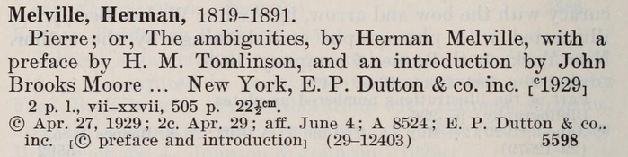

has separate entries for the preface:

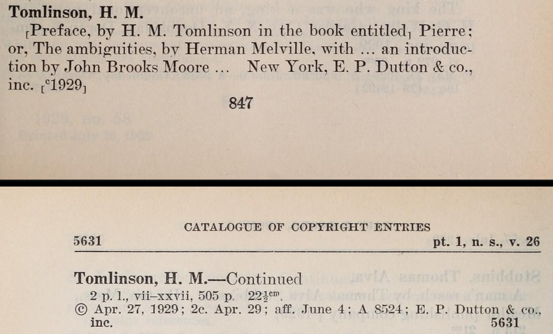

and introduction:

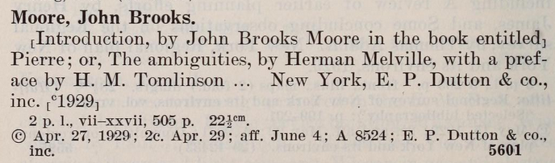

This would cause one book to be counted as three and, if there were a renewal, simply linking on registration number/date would cause it to be linked to all three entries:
 
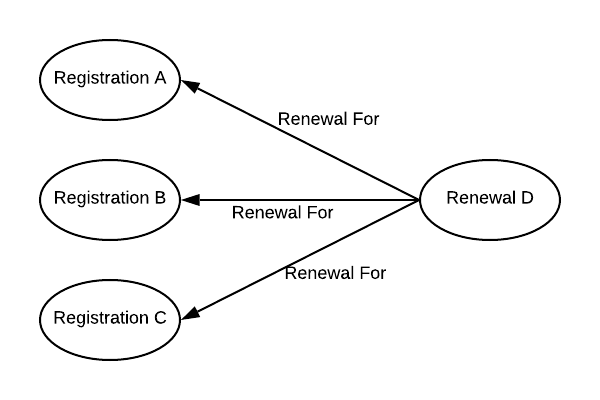

We want to indicate that two of these entries are subordinate parts of the third, and be able to link a renewal only to the main entry:

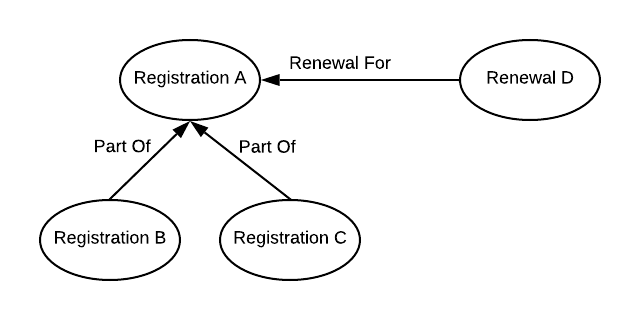

The _partOf_ attribute of the _copyrightEntry_ element can be used to indicate that one entry is a subordinate part of another. Like _duplicateOf_ the value should be the UUID of the main entry

    <copyrightEntry id="9B2C37FC-6CFA-1014-9C3C-CEA95E7AA542" 
                    regnum="A8524"
                    partOf="9B2A1015-6CFA-1014-9C3C-CEA95E7AA542">
      <author><authorName>Moore, John Brooks</authorName> </author>.  
      [<title>Introduction</title>, <author><role>by</role> <authorName>John 
      Brooks Moore</authorName> </author> <note>in the book entitled] Pierre; 
      or, The ambiguities</note>, <author><role>by</role> <authorName>Herman 
      Melville</authorName>, <role>with a preface by</role> <authorName>H. M. 
      Tomlinson</authorName> </author> &#x02026; <publisher><pubPlace>New 
      York</pubPlace>, 
      <pubName claimant="yes">E. P. Dutton &amp; co., inc.</pubName>[ 
      <pubDate date="1929">&#x00368;1929</pubDate>]</publisher> 
      <desc>2 p. l., vii-xxvii, 505 p. 22&#x000BD;&#x00368;&#x0036B;</desc>. 
      &#x000A9; <regDate date="1929-04-27">Apr. 27, 1929</regDate>; 
      <copies>2c.</copies> <copyDate date="1929-04-29">Apr. 29</copyDate>; 
      aff. <affDate date="1929-06-04">June 4</affDate>; 
      <regNum>A 8524</regNum>; <publisher>
      <pubName claimant="yes">E. P. Dutton &amp; co., inc.</pubName> 
      </publisher>
    </copyrightEntry>
    
## Bulk Registrations

When a group of books is published together as a series or a collection, they are somtimes all registered together under a single number and date. For example, in n.s. vol. 28 there are 24 entries under `A46164/1931-11-16`. The first two:

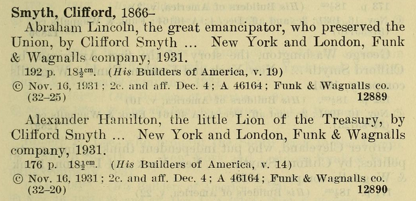

In this example they are all listed together under a single author's name so it is easy to see that they all make up the _Builders of America_ series. In other cases they all be under different authors. They are separate books as indicated by their different LCCNs, [32-25](https://lccn.loc.gov/32000025) and [32-20](https://lccn.loc.gov/32000020). In this case they are also all renewed together:

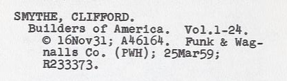

As with the `partOf` situation, this creates a single renewal pointing to multiple registration entries:

However, this is acceptable in this case. Even though these 24 entries all share a registration number, they should be counted as 24 entries and should all share the same renewal. The registration entries should have a `bulkRegistration` attribute (with a value of `yes`) to simply flag that this registration number is known to be duplicated (and can be ignored if performing a check for duplicates)

    <copyrightEntry id="F2D7831F-6E8D-1014-9CF5-AEB3FCA41D69"
                    regnum="A46164"
                    bulkRegistration="yes">...

# Corrections

## Handwritten corrections in Volumes

Some volumes have handwritten corrections. For example:

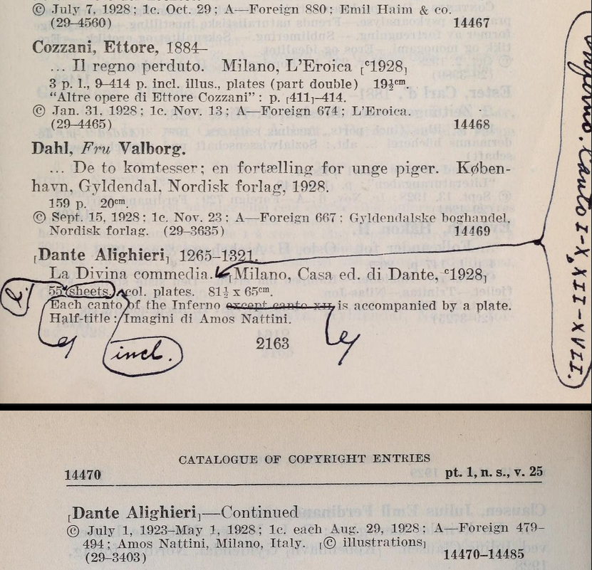

We are interested in the _correct copyright information_, so only the corrected text will be included. In this case, the corrections amount o:

    La Divina commedia. Inferno. Canto I-X, XII-XVII. Milano, Casa ed. di Dante, ᶜ1928
	55 ℓ incl. col. plates. 81½ x 65ᶜᵐ.
	Each canto of the Inferno is accompanied by a plate.
    
To indicate that this entry contains corrections, we add the `emended` attribute (with the value of `yes`). There is also an `emendationDesc` attribute that can be used to give more specifics, for example:

    emended="yes" emendationDesc="Handwritten corrections in volume"

